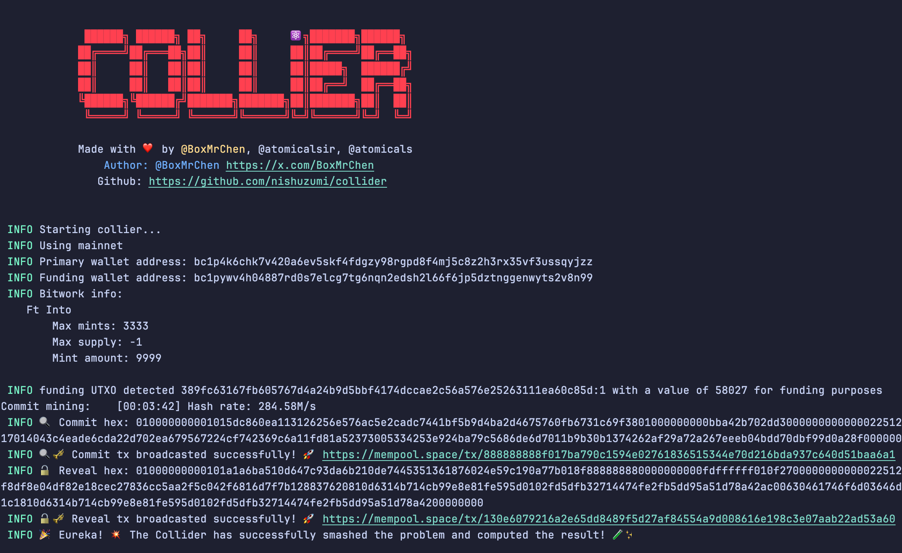

# Collider

A collider for the Atomicals protocol.

[](https://www.gnu.org/licenses/agpl-3.0.html)


## Features

- Customizable verbosity level for detailed logging
- Support for both mainnet and testnet environments
- Configurable base fee for transactions
- Primary wallet and funding wallet management
- Ticker symbol specification
- Choice of mining algorithm (CPU or GPU or custom by your self)

## Getting Started

### Prerequisites

- Rust programming language (latest stable version)
- Cargo package manager

### Installation

#### Option 1: Using Pre-compiled Binaries

1. Download the pre-compiled binary for your operating system from the [releases page](https://github.com/nishuzumi/collider/releases).

2. Extract the downloaded archive to a directory of your choice.

3. Open a terminal and navigate to the directory where you extracted the binary.

#### Option 2: Building from Source

1. Clone the repository:
   ```shell
   git clone https://github.com/yourusername/collider.git
   ```

2. Change to the project directory:
   ```shell
   cd collider
   ```

3. Build the project:
   ```shell
   cargo build --release
   ```
4. The compiled binary will be located at `target/release/collider`.

### Usage

To run the Collider, use the following command:

```shell
./collider [OPTIONS]
```

#### Command-line Options

- `-v`, `--verbose`: Sets the level of verbosity for logging.
- `-a`, `--api-url <URL>`: Specifies the API URL to connect to.
- `--testnet`: Runs the Collider in testnet mode.
- `-b`, `--base-fee <FEE>`: Sets the base fee for transactions (default: 50).
- `-p`, `--primary-wallet <WALLET>`: Specifies the primary wallet address.
- `-f`, `--funding-wallet <WALLET>`: Specifies the funding wallet private key in WIF format.
- `-t`, `--ticker <TICKER>`: Sets the ticker symbol for the collider.
- `-m`, `--miner <MINER>`: Specifies the mining algorithm to use (default: "cpu").

#### Environment Variables

Instead of passing command-line options, you can also set the following environment variables:

- `API_URL`: Equivalent to `--api-url`.
- `TESTNET`: Equivalent to `--testnet`, if you dont set this variable, the collider will run in mainnet mode.
- `BASE_FEE`: Equivalent to `--base-fee`.
- `PRIMARY_WALLET`: Equivalent to `--primary-wallet`.
- `FUNDING_WALLET`: Equivalent to `--funding-wallet`.
- `TICKER`: Equivalent to `--ticker`.
- `MINER`: Equivalent to `--miner`.

You can set these environment variables in a `.env` file in the project root directory. The Collider will automatically load the variables from this file.

Example `.env` file:

```
API_URL=https://api.example.com
TESTNET=true
BASE_FEE=100
PRIMARY_WALLET=your_primary_wallet_address
FUNDING_WALLET=your_funding_wallet_private_key
TICKER=YOUR_TICKER
MINER=cpu
```

## Performance

The following table shows the performance benchmarks

| Device       | Commit Speed (ops/s) | Reveal Speed (ops/s) |
|--------------|----------------------|----------------------|
| Apple M3 GPU | 3M                   | 5M                   |
| Apple M3 CPU | 1M                   | 1.5M                 |

## Contributing

Contributions are welcome! If you find any issues or have suggestions for improvements, please open an issue or submit a pull request.

## License

This project is licensed under the GNU AFFERO GENERAL PUBLIC LICENSE.

## Acknowledgements

(Atomicals)[https://atomicals.xyz/] - The Atomicals protocol
Atomicalsir - For providing the foundation and inspiration for this project

## Contact

For any inquiries or questions, please contact [boxmrchen@fastmail.com](mailto:boxmrchen@fastmail.com).